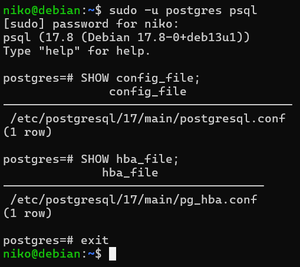
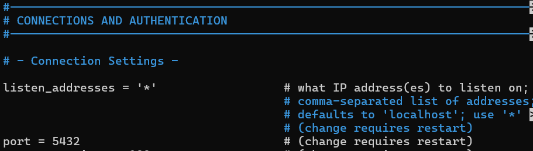
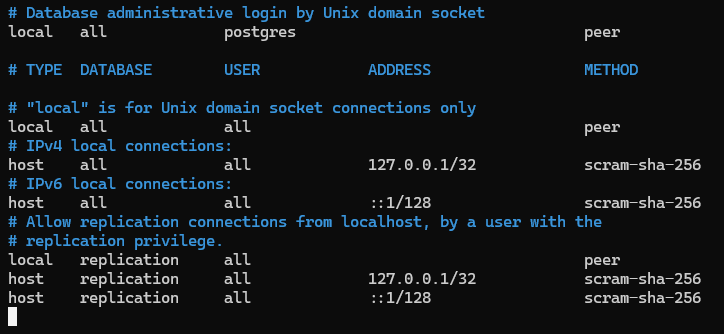
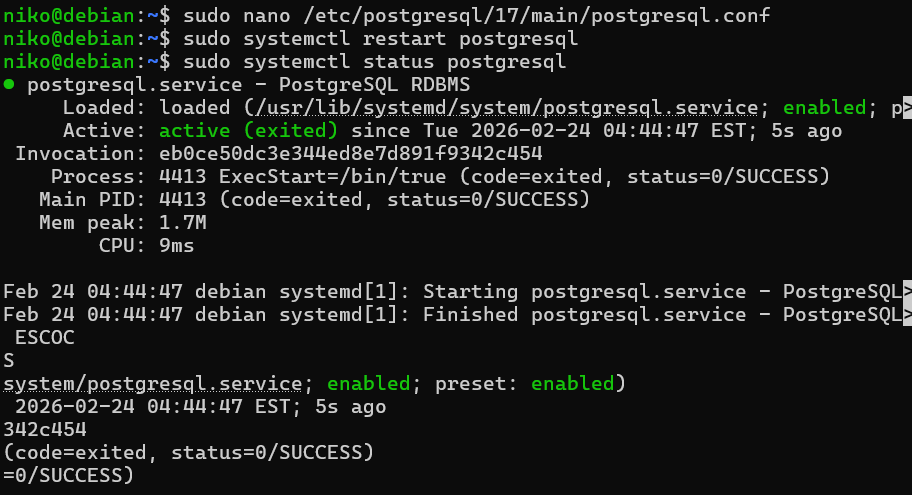
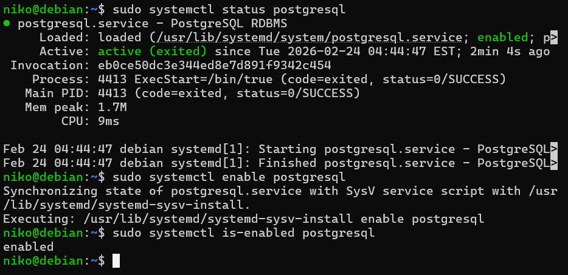
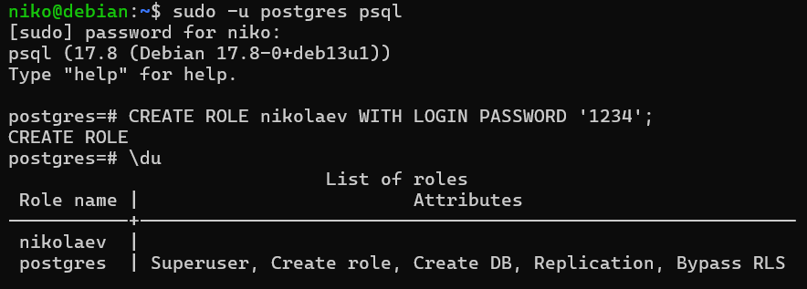
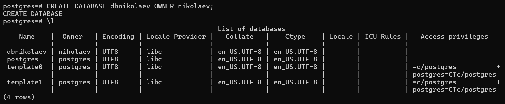
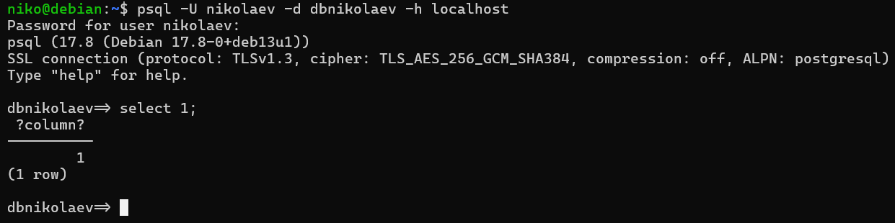
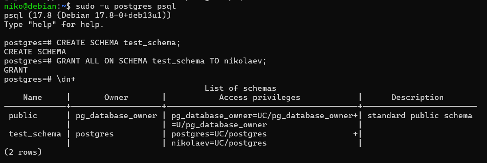

# Лабораторнапя работа №1 "Базовая настройка PostgreSQL на Debian"

Цель работы: Настроить окружение, установить PostgreSQL в Debian, освоить базовые приёмы
администрирования системы и СУБД.

## Ход работы:
- ### Подготовка среды
Установил на виртуальной машине VirtualBox Debian 13. Произвел начальную настройку системы и создал пользователя с добавление его в группу `sudo`.

Обновил систему с помощью команд `sudo apt update` и `sudo apt upgrade`.

- `sudo apt update` - проверка на новые версии;
- `udo apt upgrade` - установка обновлений.


Установил `openssh-server` для подключения к виртуалке с помощью ssh из терминала локальной машины:
```bash
sudo apt install openssh-server
```


И настроил проброс портов через настройки виртульной машины:


Подключение к виртуальной машине из терминала Windows:


- ### Установка PostgreSQL
Установил последную версию PostgreSQL:
```bash
sudo apt install postgresql postgresql-contrib
```
- `postgresql` - сам сервер PostgreSQL
- `postgresql-contrib` - набор модулей и утилит для работы c PostgreSQL


- ### Создание служебной учётной записи
При установке PostgreSQL учётная запись `postgres` создается автоматически.

Проверить наличие учётная записи можно попыткой переключения на неё:
```bash
sudo su - postgres
```


Также на скрине выше я с помощью `psql` запустит клиент PostgreSQL от имени пользователя `postgres`.

И проверил список ролей и польователей в CУБД с помощью команды `\du`.

Назначение и права в системе:

- Системный пользователь postgres - автоматическое создание при установке PostgreSQL, используется запуска процессов PostgreSQL и управления файлами СУБД без использования root.
-  Роль postgres внутри PostgreSQL - автоматическое создание при установке PostgreSQL, основная админская учетка PostgreSQL, имеет полный доступ ко всем базам и схемам, управляет другими пользователя, их ролями и привилегиями.

- ### Первичная настройка конфигурационных файлов

Изначально узнал где лежат конфики через `sudo -u postgres psql` и `SHOW config_file;`.



Далее открываем `postgresql.conf` через nano: `sudo nano /etc/postgresql/17/main/postgresql.conf`.

- postgresql.conf - основной файл конфигурации PostgreSQL, используется например для настройки порта запуска сервиса или списка прослушиваемых ip адресов:



- pg_hba.conf - отвечает за настройку аутентификации пользователей в сервисе и определяет с каких ip адресов может идти подклбчение:



Тут есть настройка подключения с локальной машины или другого host'а, указание того к каким БД и какой пользователь может подключиться, список ip адресов, с которых можно производить подключение к БД, а также метод аутентификации.

После редактирования конфигов сервис PostgreSQL был перезапушен командой:
``` bash
sudo systemctl restart postgresql
```
Также был проверен статус сервера, что он запустился и работает:



- ### Управление сервисом

Для проверки работы сервисов в системах, который инициализируются через systemd, используется утилита `systemctl`, которая позволяет запускать, останавливать, перезапускать, включать/отключать демоны, а также проверять статус служб и юнитов.

```bash
sudo systemctl status postgresql
```

Для включения автозапуска используется команда:

```bash
sudo systemctl enable postgresql
```



- ### Создание тестовой базы данных

Создание нового пользователя:



Создание новой БД:



Проверка доступности новой БД для нового пользователя:



- ### Знакомство со схемами

База данных - изолированный контейнер, который хранит все данные.
Схема - логический контейнер объектов внутри базы данных.

Создание новой схемы и выдача прав другому пользователя для работы со схемой:



При работе с разными схемами можно перед объектом указывать схему, в которой он находится:
```SQL
SELECT * FROM schema1.table;
SELECT * FROM schema2.table;
```
