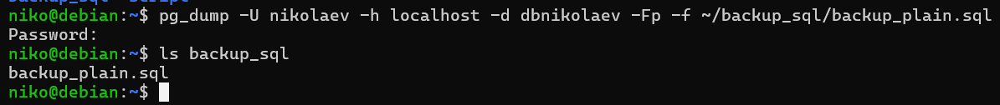
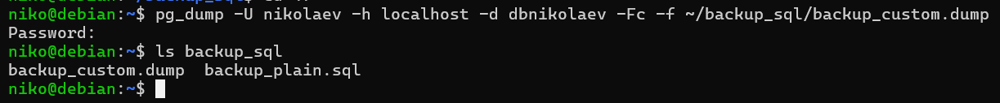
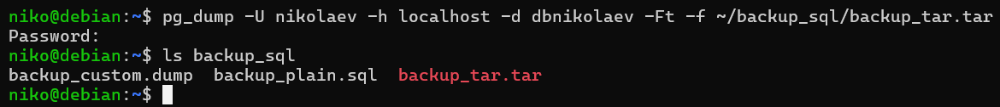
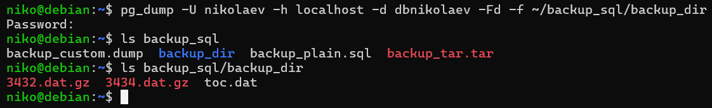
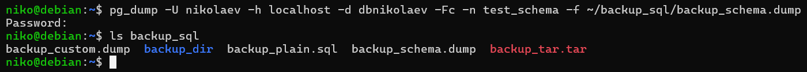
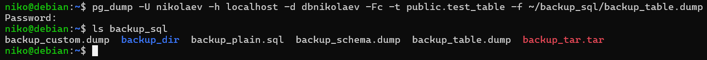
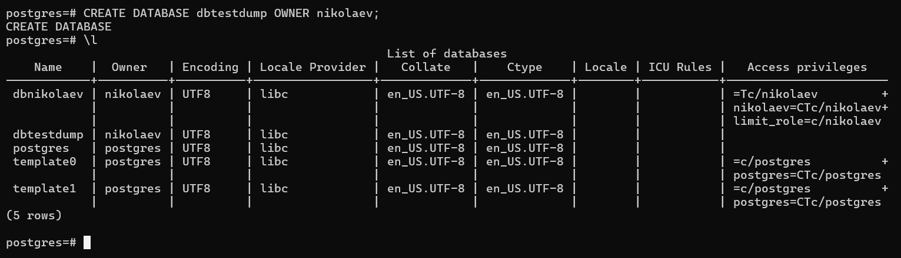
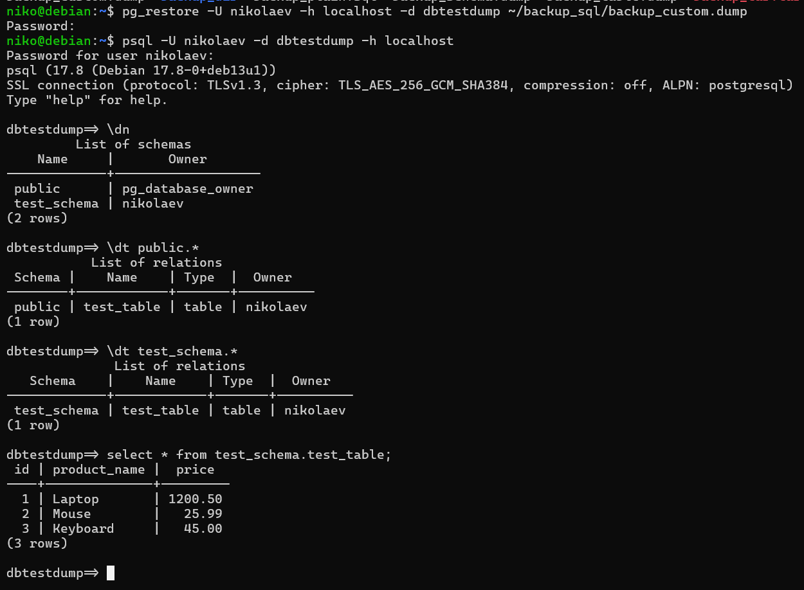
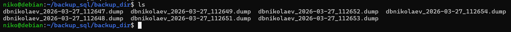
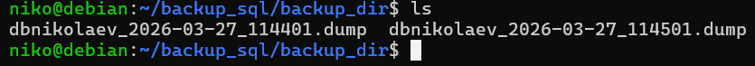

# Лабораторнапя работа №2: резервное копирование, восстановление и мониторинг в Debian и PostgreSQL

Цель работы: Изучить способы резервного копирования баз данных PostgreSQL и восстановления их в среде Debian. Освоить базовые инструменты мониторинга системы и сервиса PostgreSQL.

## Ход работы:

### 1. Утилиты резервного копирования

- `pg_dump` - создаёт логичесик й бэкап БД. Формируется дамп в виде SQL-скрипта или специального архивного формата. Позволяет гибко восстанавливать отдельные таблицы или схемы. При больших объёмах информации может быть медленным и неэффективным.

- `pg_basebackup` - утилита для физического резервного копирования сервера PostgreSQL, которая копирует все файлы базы данных на уровне файловой системы. Используется для полного восстановления сервера или настройки репликации, но не подходит для выборочного востановления объектов БД.

### 2. Создание резервной копии

Есть 4 параметра создания резервной копии:
- Plain (SQL) - `-Fp`
- Custom (кастомный) - `-Fc`
- Tar (архив) - `-Ft`
- Directory - `-Fd`

#### Plain (SQL) - `-Fp`

Создаёт обычный текстовый SQL-скрипт с командами.

Плюсы: можно редактировать вручную, подходит для изучения структуры базы, легко восстановить через psql.

Минусы: большие базы создаются медленно, нет сжатия и выборочного восстановления.



#### Custom (кастомный) - `-Fc`

Создаёт резервную копию в бинарном формате PostgreSQL с возможностью сжатия.

Плюсы: поддерживает выборочное восстановление через pg_restore, занимает меньше места, удобен для больших баз.

Минусы: нельзя открыть и редактировать вручную, для восстановления требуется pg_restore.



#### Tar (архив) - `-Ft`

Создаёт резервную копию в виде архива формата TAR, содержащего данные и структуру базы.

Плюсы: удобен для переноса и хранения, поддерживает восстановление через pg_restore.

Минусы: нельзя редактировать вручную, менее гибкий для выборочного восстановления, чем кастомный формат.



#### Directory - `-Fd`

Создаёт резервную копию в виде директории с набором файлов, где данные разбиваются на части.

Плюсы: подходит для очень больших баз данных, поддерживает параллельное создание и восстановление.

Минусы: занимает много файлов, менее удобен для хранения и переноса по сравнению с одним архивом.




### 3. Частичное (выборочное) резервное копирование

- Дамп схемы

Для создания резервной копии с определенной схемой БД используется флаг `-n *название схемы*`.



- Дамп таблиц

Для создания резервной копии с определенными таблицами из БД используется флаг `-t *название таблицы*`.



В отличии от полного дампа БД, частисное комирование сохраняет структуру/данные только указанных схем/таблиц.

### 4. Восстановление из резервной копии

Создана БД, в которую будут востанавливаться данные из дампа:



Востановление и проверка наличия данных в базе:



### 5. Автоматизация бэкапов с помощью cron

Для автоматизации бэкапов был написан скрипт:

```bash
USERDB="nikolaev"
DB="dbnikolaev"
BACKUP_DIR="$HOME/backup_sql/backup_dir"
DATE=$(date +%F_%H%M%S)

mkdir -p "$BACKUP_DIR"

pg_dump -U $USERDB -h localhost -Fc -f "$BACKUP_DIR/${DB}_$DATE.dump" $DB

cd $BACKUP_DIR
ls -1t ${DB}_*.dump | tail -n +8 | xargs -r rm --

echo "Backup for $DB completed on $DATE"
```

Данный скрипт создает резервную копию БД в формате Custom, сохраняет файл в указанной директории, также в скрипте реализована ротация, которая оставляет только 7 последник бэкапов(это сделано, чтобы избежать засорения диска).

Ручной вызов скрипта осуществляется через `./script/backup_db.sh`. Пример сохраненных бэкапов:



Для автоматизации процеса резервного копирования использовалась утилита `cron`.

Через `crontab -e` задано время запуска скрипта:
```
0 3 * * * /home/niko/script/backup_db.sh
#* * * * * /home/niko/script/backup_db.sh
```

Пример созданных бэкапов:


