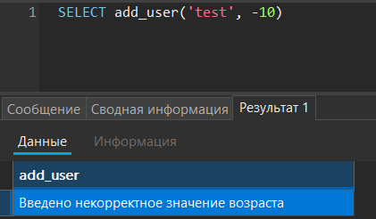
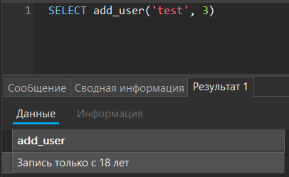
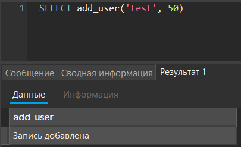
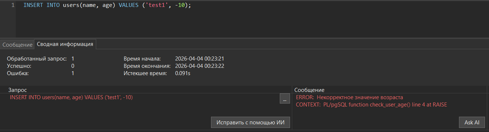
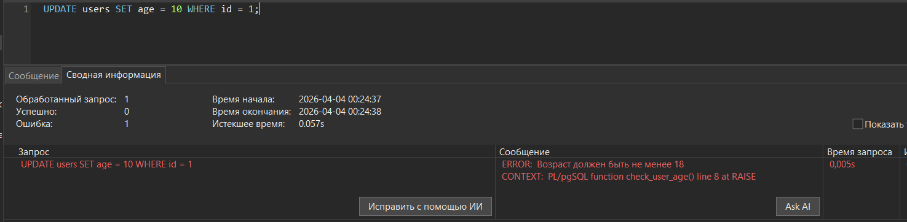
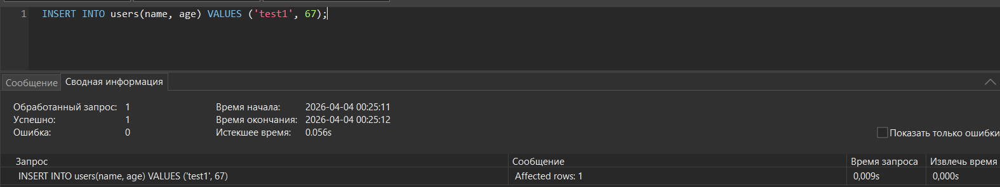
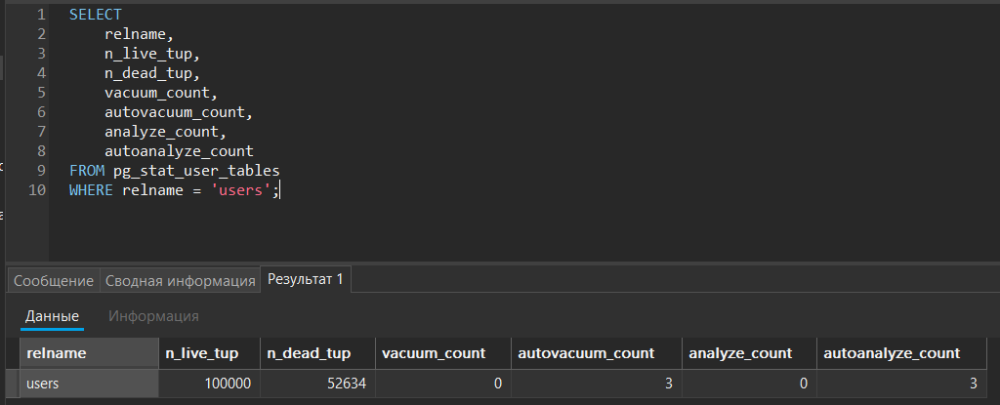
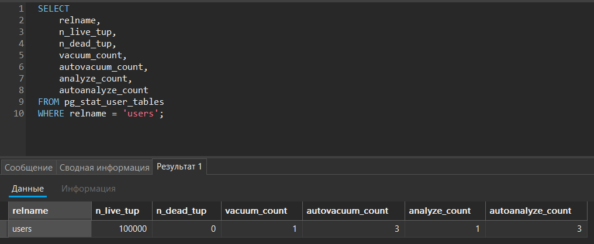

# Лабораторнапя работа №3: Расширенные возможности и оптимизация PostgreSQL на Debian

Цель работы: Получить опыт в использовании продвинутых функций PostgreSQL (индексы, планы запросов, функции и триггеры, базовые приёмы оптимизации).

## Ход работы:

### 1. Оптимизация конфигурации PostgreSQL

Для виртуальной машины с 6 ГБ RAM установлены следующие значения:

- `shared_buffers = 1536MB` - определяет объём памяти для кэширования данных PostgreSQL.

- `work_mem = 24MB` - задаёт память на операции сортировки и соединений.

- `maintenance_work_mem = 512MB` - используется для операций обслуживания (VACUUM, создание индексов).

- `effective_cache_size = 4GB` - определяет объём доступного кэша.

Проверка установленных параметров:


### 2. Создание и анализ индексов

Создал новую таблицу `users` и заполнил её данными через `generate_series`:

```SQL
INSERT INTO users (name, age)
SELECT 
  'user_' || gs,
  (random() * 60 + 18)::int
FROM generate_series(1, 100000) AS gs;
```


Анализ запроса до создания индекса:


Создаём индекс по полю `age`:

```SQL
CREATE INDEX idx_users_age ON users(age);
```

Анализ запроса после создания индекса:


Сравнение результатов анализа работы показало уменьшение времени выполнения запроса.

### 3. Хранимые функции

Создана функция вставки данных в таблицу с проверкой коректности введенного возраста:

```SQL
CREATE OR REPLACE FUNCTION add_user(
  p_name TEXT,
  p_age INTEGER
)
RETURNS TEXT AS
$$
BEGIN
    IF p_age < 0 OR p_age > 150 THEN
        RETURN 'Введено некорректное значение возраста';
    
    ELSIF p_age < 18 THEN
        RETURN 'Запись только с 18 лет';
    
    ELSE
        INSERT INTO users(name, age)
        VALUES (p_name, p_age);
        
        RETURN 'Запись добавлена';
    END IF;
END;
$$ LANGUAGE plpgsql;
```

Пример работы:







### 4. Триггеры

Создание функции для  риггера:

```SQL
CREATE OR REPLACE FUNCTION check_user_age()
RETURNS TRIGGER AS
$$
BEGIN
    IF NEW.age < 0 OR NEW.age > 150 THEN
        RAISE EXCEPTION 'Некорректное значение возраста';
    END IF;

    IF NEW.age < 18 THEN
        RAISE EXCEPTION 'Возраст должен быть не менее 18';
    END IF;

    RETURN NEW;
END;
$$ LANGUAGE plpgsql;
```

Создание триггера:

```SQL
CREATE TRIGGER trg_check_user_age
BEFORE INSERT OR UPDATE ON users
FOR EACH ROW
EXECUTE FUNCTION check_user_age();
```

Проверка работы:







### 5. Автоматическая очистка и статистика (VACUUM, ANALYZE)

- `VACUUM` - Удаляет "мёртвые" строки, которые остаются после UPDATE и DELETE и освобождает место внутри таблицы.

- `ANALYZE` - Обновляет статистику распределения данных, которая потом используется для оптимизации запросов.

Парамерты:

- `autovacuum` - включает автоматическую очистку таблиц
- `autovacuum_naptime` - указывает частоту запуска запуска по времени
- `autovacuum_vacuum_scale_factor` - доля изменённых строк, после которой запускается VACUUM

Обновил примерно половину строк в таблице чтобы появились "мертвые" строки:

```SQL
UPDATE users SET age = 50 WHERE age < 50;
```



Запустил ручную отчистку:

```SQL
VACUUM ANALYZE users;
```



Представления `pg_stat_user_tables` показывает статистику по таблицам пользователя: количество "живых" и "мёртвых" строк, а также сколько раз выполнялись ручной и автоматический VACUUM и ANALYZE.

Представление `pg_stat_all_indexes` показывает статистику по индексам: сколько раз индекс использовался для поиска, сколько строк было прочитано и извлечено.