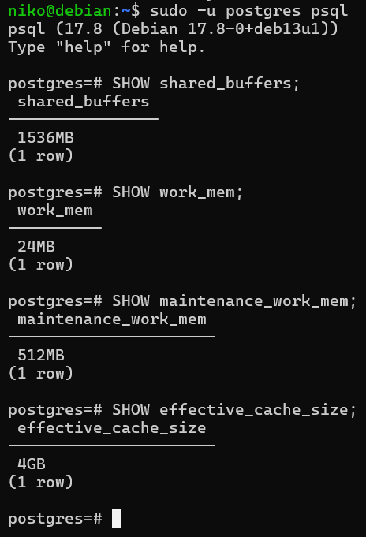
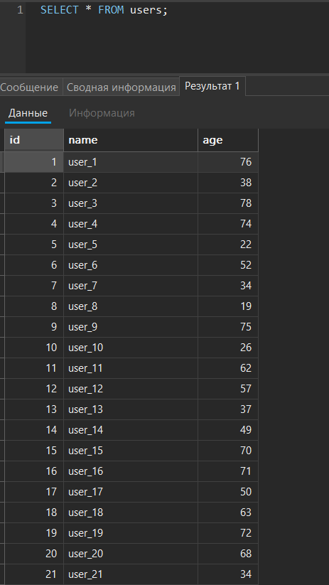
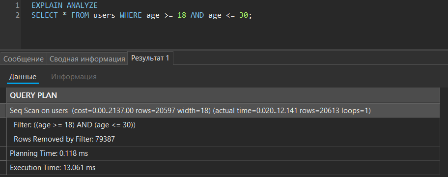
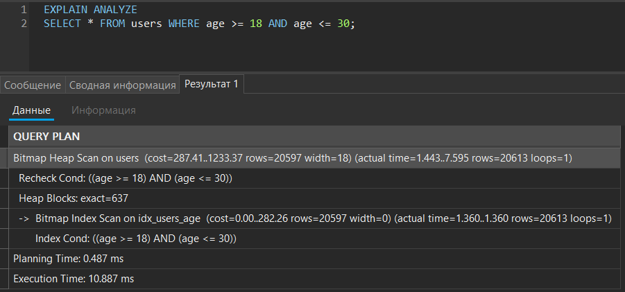

# Лабораторнапя работа №3: Расширенные возможности и оптимизация PostgreSQL на Debian

Цель работы: Получить опыт в использовании продвинутых функций PostgreSQL (индексы, планы запросов, функции и триггеры, базовые приёмы оптимизации).

## Ход работы:

### 1. Оптимизация конфигурации PostgreSQL

Для виртуальной машины с 6 ГБ RAM установлены следующие значения:

- `shared_buffers = 1536MB` - определяет объём памяти для кэширования данных PostgreSQL.

- `work_mem = 24MB` - задаёт память на операции сортировки и соединений.

- `maintenance_work_mem = 512MB` - используется для операций обслуживания (VACUUM, создание индексов).

- `effective_cache_size = 4GB` - определяет объём доступного кэша.

Проверка установленных параметров:



### 2. Создание и анализ индексов

Создал новую таблицу `users` и заполнил её данными через `generate_series`:

```SQL
INSERT INTO users (name, age)
SELECT 
  'user_' || gs,
  (random() * 60 + 18)::int
FROM generate_series(1, 100000) AS gs;
```



Анализ запроса до создания индекса:



Создаём индекс по полю `age`:

```SQL
CREATE INDEX idx_users_age ON users(age);
```

Анализ запроса после создания индекса:



Сравнение результатов анализа работы показало уменьшение времени выполнения запроса.

### 3. Хранимые функции

